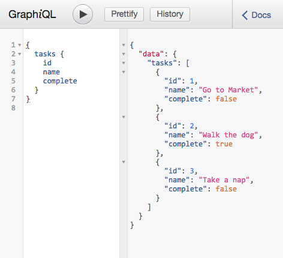

# Example: Apollo Graphql

Tiny example with [Apollo Graphql](https://www.apollographql.com/)

It uses the [`Apollo Server`](https://github.com/apollographql/apollo-server) a community-maintained open-source GraphQL server.

## Setup
```sh
$ npm install
$ npm start
```

## Usage
You can use it with any apollo client or with the [Graphiql](https://github.com/graphql/graphiql) in [localhost](http://localhost:3000/graphiql)

## Available queries
```
{
  tasks {
    id
    name
    complete
  }
}
```

```
{
  task (id: Int!) {
    id
    name
    complete
  }
}
```


